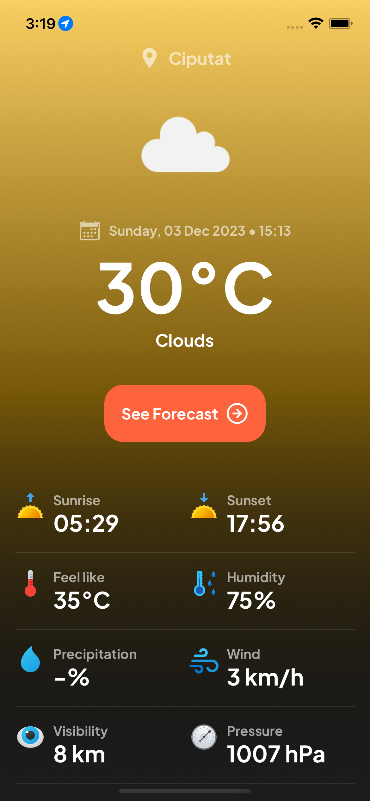
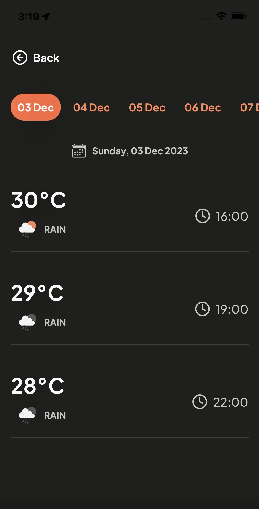
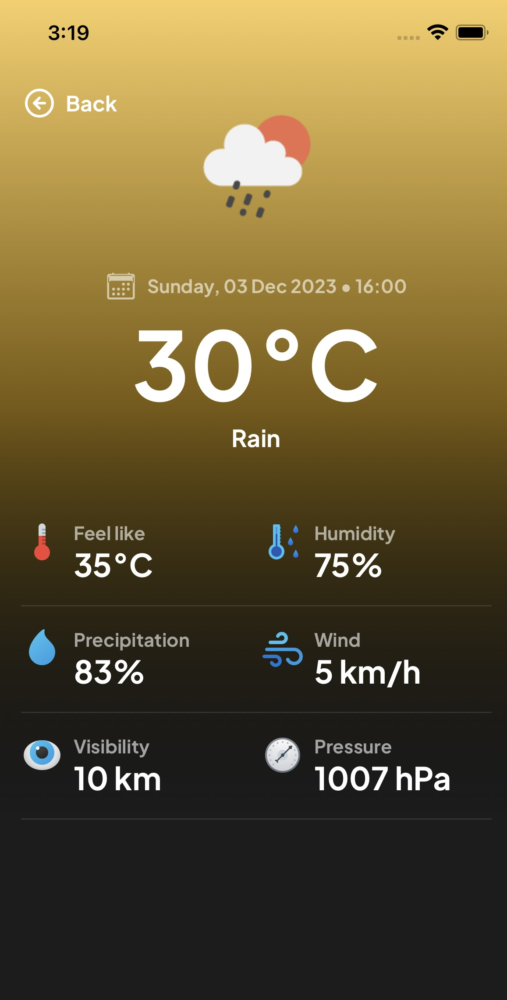

# ClimaCast - Your Weather Companion 🌦️

Welcome to ClimaCast, your go-to mobile app for weather forecasting built with the power of React Native. Stay ahead of the weather curve with real-time updates and precise forecasts, all powered by [OpenWeather's Open API](https://openweathermap.org/).

## Main Features:

- 🌍 Display current weather information at your fingertips.


- ⏰ Get detailed weather forecasts for the next 5 days, updated every 3 hours.


- 📊 Dive into the nitty-gritty with in-depth information on selected weather forecasts.


## How to Run:

1. **Clone the Repository:**
   ```bash
   git clone https://github.com/developerchan1/ClimaCast.git
2. **Switch to the Master Branch:**
   ```bash
   git checkout master
3. **Go to project directory:**
    ```bash
    cd ClimaCast
4. **Install Dependencies:**
    ```bash
    npm install
5. **Choose the way to run this apps:**
    * Press a for Android emulator or i for iOS simulator. Expo CLI will automatically install Expo Go if not already present.
    * Alternatively, install Expo Go on your device and scan the barcode displayed after running npm run start.
6. **Location Permission:** Grant permission when prompted. Location access is crucial for accurate weather data.
7. **You're All Set!** Congratulations! Explore the app, navigate seamlessly between screens, and make the most of ClimaCast.
